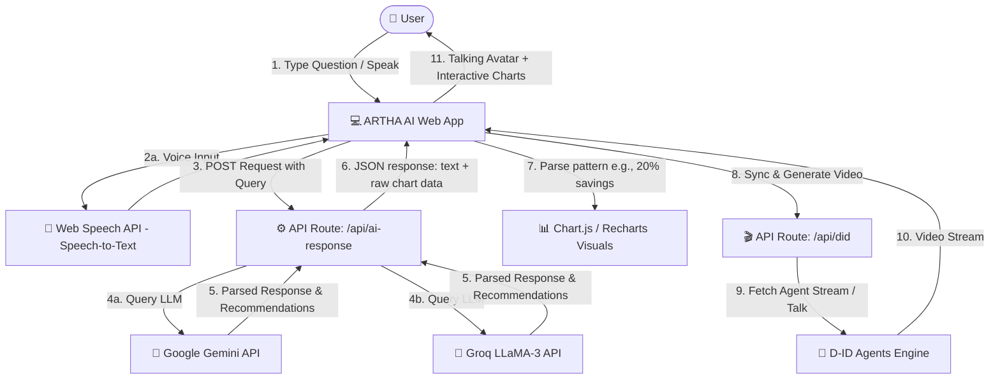

# 🪙 ARTHA AI — AI Digital Wealth Advisor

ARTHA AI is a next-generation personalized wealth management and interactive financial advisory platform. Powered by state-of-the-art Generative AI, Large Language Models (LLMs), and cutting-edge digital avatar technologies, ARTHA AI guides users through investment optimization, spending analysis, portfolio strategies, and real-time budgeting projections with an interactive talking avatar.

---

## 🗺️ System Architecture & Interaction Flow



### Flow Walkthrough
1. **User Interaction**: The user asks a financial question via typing or speaking (microphone input converted using Web Speech API).
2. **AI Advisory Routing**: The query is processed by Next.js API endpoints (`/api/ai-response`). If API keys are present, it dynamically orchestrates calls to GenAI providers. If offline or on query failure, it routes to local custom rules.
3. **LLM Orchestration**:
   - **Gemini API**: Synthesizes responses based on user history, wealth targets, and advanced planning instructions.
   - **Groq API**: Offers high-speed secondary logic generation.
4. **Data & Visualization Extraction**: The system extracts percentages, lists, and numbers from the LLM text output to construct dynamic interactive charts in real-time.
5. **D-ID Video Avatar Synthesis**: The synthesized text response is sent to the D-ID API wrapper (`/api/did`) to stream real-time facial animations and speak directly to the user.

---

## 🛠️ Technology Stack

### 1. Generative AI & Large Language Models (LLMs)
*   **Google Gemini (Gemini 1.5 Pro / Flash)**: Serves as the primary core reasoning engine, delivering sophisticated financial projections, risk management calculations, and personalized budgeting advice.
*   **Groq API (LLaMA-3 / Mixtral)**: Utilized for high-concurrency, ultra-low-latency assistant messaging.
*   **D-ID Streaming Agent API**: Translates text responses into a high-fidelity interactive video avatar stream with synchronized lipsync.

### 2. Speech & Animation
*   **Web Speech API**: In-browser speech-to-text processing for hands-free voice interactions.
*   **Custom SVG Vector Engine**: Offline vector animation engine that acts as a fallback or lightweight interface option, rendering interactive facial expressions, idle animations, and talking gestures.

### 3. Frontend & Core Structure
*   **Next.js (React Framework)**: Server-side rendering, API routes, and optimized client loading.
*   **TypeScript**: Type safety and self-documenting code.
*   **Tailwind CSS**: Glassmorphism UI patterns, dark mode support, and premium responsive components.

---

## 📁 Project Structure

```filepath
├── app/
│   ├── api/
│   │   ├── ai-response/        # AI engine logic handling Gemini & Groq prompts
│   │   ├── copy-avatar/       # Synchronization utilities for D-ID avatars
│   │   ├── did/               # Polling and generation endpoints for D-ID videos
│   │   └── ...
│   ├── globals.css            # Base Tailwind and custom styles
│   ├── layout.tsx             # Root Layout with Font & SEO optimization
│   └── page.tsx               # Main Dashboard redirect
│   └── artha-ai/              # Main Dashboard holding ARTHA AI core layout
├── components/
│   ├── AdvisoryPanel.tsx      # Main Chat, speech-to-text, and visual response panel
│   ├── Avatar.tsx             # Video playback wrapper for D-ID video streams
│   ├── Customizer.tsx         # Panel controls for styling and configuring the advisor
│   ├── VectorAdvisoryPanel.tsx
│   └── VectorAvatar.tsx       # SVG vector drawing and animation routines
├── public/                    # Assets, logos, and icons
├── next.config.js             # Vercel deployment optimizations
├── tsconfig.json              # TypeScript compilation rules
└── .gitignore                 # Clean environment/dependency exclusions
```

---

## ⚡ Deployment & Running Locally

### 1. Installation
Clone the repository and install the dependencies:
```bash
npm install
```

### 2. Configure Environment Variables
Create a `.env` or `.env.local` file in the root directory:
```env
# D-ID Avatar Keys
DID_API_KEY=your_did_api_key
NEXT_PUBLIC_DID_AGENT_ID=your_did_agent_id

# AI Providers
NEXT_PUBLIC_GEMINI_API_KEY=your_gemini_api_key
```

### 3. Run the Development Server
```bash
npm run dev
```
Open [http://localhost:3000](http://localhost:3000) in your browser to interact with **ARTHA AI**.
